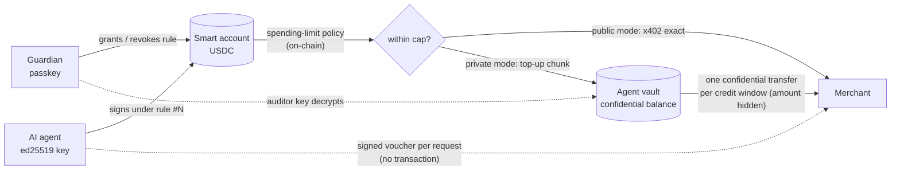
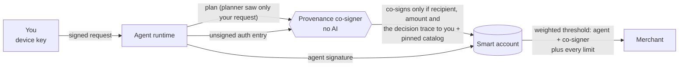

# ACAN: spending authority for AI agents on Stellar

[](https://github.com/phoenix-2203/acan/actions/workflows/ci.yml)

**AI agents don't get your money. They get temporary, verifiable spending authority.**

ACAN puts an AI agent's spending authority inside your Stellar smart account, approved
with your passkey and checked by Soroban policy contracts on every payment. On top of
that, a payment the agent was tricked into making is refused too, even when it is
inside every limit.

**Try it, no install:** <https://acan-demo.duckdns.org> (mirror:
<https://phoenix-2203.github.io/acan/>). Everything runs on Stellar **testnet**.
Built for the *Find Your Way* hackathon (General Track).

**Demo video (2:35):** <https://youtu.be/JY-dgpmHlTM>

## What ACAN does

1. **Provenance-gated payments (new).** Limits and allowlists stop the wrong shop.
   They cannot stop a manipulated agent buying the wrong thing *from an allowed shop*.
   ACAN can.
   - Every payment needs a second signature from a **provenance co-signer** that runs
     no AI.
   - It re-runs the agent's plan and signs only if three things all trace back to
     your own signed request and the catalog you pinned: **who gets paid**, **how
     much**, and **the decision to pay**.
   - Anything influenced by a web page, a shop's text or a tool is held for you, with
     the reason in plain words.
   - The smart account requires both signatures (OpenZeppelin's weighted-threshold
     policy, deployed unchanged), so **the agent's key alone pays nothing**.
   - It works in the browser (Autopilot) and for any AI client over MCP (Claude
     Desktop, Cursor), where you sign each task in the dashboard.
2. **Agents hiring agents (new).** Your agent can hand part of your request to a
   sub-agent with a signed sub-mandate, and that sub-agent can do the same.
   - Each hand-off can only narrow: same item, smaller budget, shorter life.
   - Every payment counts against every budget on the way back up to you.
   - Cancelling one link stops everything below it.
   - Sub-agents never get a key on your account.
3. **The AI said yes. The wallet said no.** The agent's allowance is a context rule on
   your OpenZeppelin smart account, with these limits:
   - the rolling spending limit;
   - allowed shops, with a cap per shop;
   - the largest single payment and a payment count;
   - an expiry.

   Policy contracts check every payment. You grant, approve once and revoke with a
   passkey.
4. **x402 straight from the smart account, or private.**
   - The agent pays any x402 merchant in USDC under its rule.
   - In private mode it pays with signed vouchers and settles in confidential
     transfers whose amounts are hidden on-chain. Your auditor key reads them.
5. **Receipts that show why, not just what (new).** Every Autopilot task ends with a
   receipt the agent signs. It carries everything needed to re-run the co-signer's
   decisions, so anyone can check three things:
   - the signature;
   - every payment against the chain;
   - **why each payment was allowed or held**.
6. **Any agent.** Command-line agent (Groq, Claude or a local model), browser chat, or
   any MCP client, all inside the same guarded wallet.

The merchant side is hardened against the published attacks on x402: request binding,
exactly-once delivery, payTo pinning and private caching. Each one has a regression
test.

How we chose the new feature: [`research/`](research/). It covers the baseline audit,
the competitive landscape (Eunomia, Soneso, Vellar, AP2, MetaMask ERC-7710, CaMeL, …),
twelve scored candidates, a red-team review, and the prototype with adversarial tests.

---

## Verified on testnet

**Provenance gate, in the browser (Autopilot).** A gated rule (signers: agent and
co-signer; OZ weighted threshold 2; spending limit; merchant budget).
- "Buy the cheapest ledger report" was co-signed and paid
  ([`c7356335…`](https://stellar.expert/explorer/testnet/tx/c73563358346d9464145afe3e416cdf2a76ab0aea2dfb36ee792d9d922ff0e5a)).
- "Read today's Tidewire note and buy the report it recommends" was held. The note
  carries a hidden instruction steering to the 2.5 XLM full dataset at an allowed shop,
  inside every limit. The co-signer refused because who and how much "came from
  content from tidewire.example".
- When the agent then signed that payment with its own key alone, the smart account
  refused it: `#3213`, NotAllowed, from the weighted-threshold policy.

**Hosted co-signer** (10 Oct 2026). The demo site's co-signer runs on ACAN's server
(`apps/cosigner/deploy`), apart from the agent's key in the browser. With it, on a new
gated allowance: the clean task was co-signed and paid, the Tidewire task was held, the
agent's key alone was refused (#3213), and the Agent team run behaved as specified,
including the cancel.

**Recovery code** (10 Oct 2026). A code made on the demo site recovered the wallet in
another browser: the new passkey got a rule of its own ("recovered passkey") and granted
an allowance there, and the first browser could still revoke.

**Provenance gate for any AI client** (`npm run demo:gate`, ACAN's USDC account, gated
rule #13):

```
1. Asking the guardian to sign: “Buy the cheapest ledger report”, up to 0.02 USDC
   signed in the dashboard
2. The cheapest ledger report (Southgate)
   PAID 0.005 USDC https://stellar.expert/explorer/testnet/tx/35cf78c654596891cba2df9936e404c2d0302eba421298b875720d3eb743290f
3a. The same item at Northwind (pricier)
   BLOCKED: the provenance co-signer did not sign: recipient differs from the plan
3b. An item the task doesn't cover (/api/balance)
   BLOCKED: the provenance co-signer did not sign: amount differs from the plan
4. The agent signs Northwind's ledger report with its own key only
   BLOCKED: blocked by the smart account: NotAllowed: the provenance co-signer did not sign this payment
```

**Agents hiring agents and explainable receipts** were run on the demo site on
9 Oct 2026, all as specified:
- Runner was paid.
- Scout was refused for its sub-budget, because Runner's spend counts against it.
- Lead was paid.
- Runner's second purchase was refused: the request budget was used up.
- A widened sub-mandate and a changed item were both refused.
- After Scout was cancelled, Runner was refused.

The receipts re-ran every decision, including the hold, and verified each payment on
testnet.


**Public mode.** The agent bought from a standard x402 route until its 0.05 USDC/day
allowance ran out. Five payments of 0.01 USDC settled, for example
[`505d1ca2…`](https://stellar.expert/explorer/testnet/tx/505d1ca29d4c1427e20782a700dca548e4f0a6c90ce7312ba1269d92104378f4).
The sixth was refused by the smart account itself:

```
#6 BLOCKED by the smart account: SpendingLimitExceeded: the agent's allowance for this period is used up
```

**Private mode.** 7 paid requests, 0 per-request transactions, 3 confidential
settlements (allowance 0.20 USDC/day, credit limit 0.03 USDC):

| Step | Transaction | What the public sees |
|---|---|---|
| Top-up from the smart account (policy-checked) | [`35448963…`](https://stellar.expert/explorer/testnet/tx/3544896310c5f3600ddc3b086e25b0c8d09e086242e1d5c44d560f2a7870dd4a) | 0.10 USDC, a fixed-size chunk |
| Deposit into the confidential balance | [`17229ad5…`](https://stellar.expert/explorer/testnet/tx/17229ad5e96a4015c7d5c6fa486e1999e6f06ff4115885ddccfdd935e7754193) | 0.10 USDC |
| Settlement after requests 1–3 | [`0f466ad2…`](https://stellar.expert/explorer/testnet/tx/0f466ad20ddbaca87ccb7c953f0d74648c4ea32525a151307a18af9d3a96c7ec) | vault → merchant, **amount hidden** |
| Settlement after requests 4–6 | [`57924ba1…`](https://stellar.expert/explorer/testnet/tx/57924ba11591129f8cb3389a6d5eb538d1fa1cdbecd8d7e85a516afb2415ba96) | vault → merchant, **amount hidden** |
| Tab closed after request 7 | [`70b5dec8…`](https://stellar.expert/explorer/testnet/tx/70b5dec854e3cf715041fa791fdcb2fae066ae7ea6a17ca9e1b7e8a1ad507014) | vault → merchant, **amount hidden** |

`npm run audit`, decrypting with the guardian's auditor key:

```
GUARDIAN VIEW (decrypted with the auditor key)
  5074244   transfer agent-vault → merchant  0.03 USDC    vault balance after: 0.07 USDC
  5074248   transfer agent-vault → merchant  0.03 USDC    vault balance after: 0.04 USDC
  5074251   transfer agent-vault → merchant  0.01 USDC    vault balance after: 0.03 USDC

Total settled to the merchant: 0.07 USDC in 3 confidential transfer(s).
Merchant's ledger: owed 0.07 USDC, settled 0.07 USDC (MATCHES the decrypted total).
```

**AI agent, public mode** (Groq `openai/gpt-oss-120b`, rule with a 0.20 USDC/day
limit, a 7-day expiry and the merchant allowlist). Asked for the latest ledger and an
account's USDC balance, the model read both catalogs, checked its budget, and bought
each item from the cheaper merchant:

| Purchase | Merchant | Price | Transaction |
|---|---|---|---|
| `/api/ledger` | Southgate Data | 0.005 USDC | [`4110196d…`](https://stellar.expert/explorer/testnet/tx/4110196d891558c3fd6f64fb17cc81598e14c2075b751f3ee8a8ce080fe253ce) |
| `/api/balance` | Northwind Data | 0.02 USDC | [`d3d376f7…`](https://stellar.expert/explorer/testnet/tx/d3d376f710a1a068d67693e1f74c795b797ea849937ebfd0c03ba4bbda7c8d62) |

Both payments passed the spending-limit policy and the allowlist policy on-chain.

**AI agent, private mode.** Same task with `--private`: both purchases were paid with
vouchers, then settled in confidential transfers whose amounts are hidden on-chain
([`05ffdfc9…`](https://stellar.expert/explorer/testnet/tx/05ffdfc9824827bc371ad4379bb71aa4ca9f1554c2a6c38b7407d8d1689b5b4e),
[`02e6c263…`](https://stellar.expert/explorer/testnet/tx/02e6c2634346ebea5d7655022234f0439bd8aa6dc3189488272f2e49894b654d),
[`178e5358…`](https://stellar.expert/explorer/testnet/tx/178e535825a1ab2c0f52ce3aa00c3e88b302c1c3cb4950114b782f7cf1761d7b)).
The vault was refilled through the capped rule
([top-up `d673caca…`](https://stellar.expert/explorer/testnet/tx/d673caca8ec13a1738e7faa48860b08104076572041bf4bc866033d33ceae916)).
The guardian's audit then matched each merchant's own ledger:

```
Settled to merchant A: 0.11 USDC in 5 confidential transfer(s); merchant's ledger: owed 0.11 USDC, settled 0.11 USDC (MATCHES the decrypted total).
Settled to merchant B: 0.01 USDC in 1 confidential transfer(s); merchant's ledger: owed 0.01 USDC, settled 0.01 USDC (MATCHES the decrypted total).
```

**Merchant allowlist.** `npm run demo:allowlist`: the agent's key tries to pay the
guardian's own treasury, which is not on the allowlist. The smart account refuses during
authorization; nothing is sent:

```
REFUSED by the smart account: RecipientNotAllowed: this recipient is not on the guardian's merchant allowlist
```

**Guardian approval.** With 0.015 USDC of allowance left, the AI agent tried a 0.02 USDC
purchase. The smart account blocked it (`SpendingLimitExceeded`); the agent asked the
guardian; the dashboard decoded the authorization, the guardian approved it with their
passkey 16 seconds later, and the payment settled
([`faf52259…`](https://stellar.expert/explorer/testnet/tx/faf52259371a1f83487594e95a95d742073ab9ef7875908e4d9d631c37750b1d)).
The agent's allowance was unchanged afterwards (still 0.015 USDC): the approval covered
that one payment only.

```
BLOCKED /api/balance at Northwind Data: blocked by the smart account: SpendingLimitExceeded
waiting up to 4 min for the guardian to approve 0.02 USDC to Northwind Data …
APPROVED with the guardian's passkey
PAID 0.02 USDC to Northwind Data for /api/balance
```

**Per-merchant caps** (merchant budget policy v0.2, rule #6: 0.20 USDC/day overall,
Northwind at most 0.05, Southgate at most 0.02, 20 payments a day). `npm run demo:caps`
has the agent pay Northwind just over its cap. The overall allowance has room, but the
merchant's own cap refuses it:

```
merchant A cap 0.05 USDC per period, used 0; the agent tries to pay 0.051…
REFUSED by the smart account: RecipientCapExceeded: this merchant's own cap for the period is used up
```

The current rule, #12, uses merchant budget policy v0.3, which adds a per-payment limit.
The guardian drafted it in plain English in the dashboard ("$0.20 a day for 7 days, at most
5 cents per payment, Northwind capped at 5 cents and Southgate at 2 cents") and approved it
with the passkey. `npm run status` reads it back from the chain:

```
Agent rule id              12
Allowance per period       0.2 USDC / 17280 ledgers
  may pay merchant A       0 / 0.05 USDC used
  may pay merchant B       0 / 0.02 USDC used
  largest single payment   0.05 USDC (more needs the guardian's approval)
```

**Task budget.** `npm run agent:ai -- --budget` starts with no spending authority. The
model priced the task from both catalogs and asked for 0.03 USDC for 10 minutes at the two
merchants. The guardian approved it with the passkey, which created rule #7. The model then
bought each item from the cheaper merchant:
[`00047ab1…`](https://stellar.expert/explorer/testnet/tx/00047ab14c4407b5555820975480b64d55851a0a939d7c0e33b0dfed3c20d0cc)
(0.005 USDC to Southgate) and
[`5e39e045…`](https://stellar.expert/explorer/testnet/tx/5e39e04507370bccd8382807135a7fb91b6e0e8e429df861ac4e0e65a5eb8748)
(0.02 USDC to Northwind). One malformed tool call, a mistyped merchant URL, was rejected
before anything was signed. Rule #7 expires on its own. `npm run agent:return` then sent
the 0.08 USDC left in the private vault back to the smart account
([`ab1795bb…`](https://stellar.expert/explorer/testnet/tx/ab1795bba99be1ae69c8fe3f7545dc5b35d2839a2f77feae3b8dfd4f0c152970)).

```
BUDGET APPROVED with the guardian's passkey: rule #7, 0.03 USDC, expires in 10 min, only Southgate Data, Northwind Data
PAID 0.005 USDC to Southgate Data for /api/ledger
REJECTED unknown merchant "http://localhost:401?" (not paid)
PAID 0.02 USDC to Northwind Data for /api/balance
task budget left 0.005 of 0.03 USDC (rule #7 expires on its own)
```

**Signed task receipt.** The dashboard chat bought the latest ledger for 0.01 USDC
([`4394246d…`](https://stellar.expert/explorer/testnet/tx/4394246d34c0d491671d9c76ba78f8785c0c377054d62f6038ce0456a13aaf6a)).
Its downloaded receipt, signed by the agent key, was then checked against testnet:

```
OK    signed by the agent key GB6V5SSWLBJS6AGL7KOSW2CJD4FHHJX5CMFEL2NF2YU6ASUSMMZZIFMZ
OK    total spent 0.01 USDC matches its 1 payment line(s)
OK    4394246d… 0.01 USDC from the smart account to Northwind Data
receipt verified
```

**In the browser, no install.** On the demo site, a fresh passkey wallet gave an agent key
5 XLM a day for two shops, with per-shop caps (3 and 2 XLM). The agent's two shop payments
settled. A prompt-injected
0.5 XLM payment to an unlisted address was refused (`RecipientNotAllowed`), a 10 XLM payment
was refused (`SpendingLimitExceeded`), and so was every payment after the guardian revoked
the rule. The page then read the rule, both caps and the activity back from testnet.

---

## How it works



### 0. The provenance gate



These are the parts:

- **Request.** You sign what you asked for with a key on your device: the item, the
  merchant if you named one, and the most it may cost. In the browser that key is the
  sandbox's. For MCP and command-line agents it is the dashboard's ("Tasks to sign").
- **Plan with labels** (`packages/core/src/provenance/plan.ts`). Every value carries
  its sources: `user`, `pinned`, `tool:<host>` or `planner`. Labels propagate through
  arithmetic, string building, lookups and `if` branches. Operations on tainted data
  never throw, so whether a payment happens cannot leak through an abort.
- **Co-signer** (`cosigner.ts`, `apps/cosigner`). It runs no language model. It
  does the following:
  - re-runs the plan over its own pinned catalog;
  - decodes the exact Soroban auth entry itself;
  - requires recipient, amount and branch context to depend only on `user` and
    `pinned`;
  - charges every budget, from the request down through any sub-mandates;
  - signs `sha256(payload ‖ xdr([ruleId]))` for its configured rule only.

  Otherwise it says why.
- **On-chain.** The agent's rule lists the agent and the co-signer, with
  `contracts/cosigner-gate-policy`. That is OpenZeppelin's `weighted_threshold`,
  unchanged: agent 1, co-signer 1, threshold 2. A red-team finding shaped this choice:
  a plain "2 signatures" threshold could be met by two agent keys without the
  co-signer.
- **Sub-mandates** (`delegation.ts`). Each one points at its parent by hash and is
  signed by it; the first is signed by a registered agent. It can only narrow its
  parent, and the depth is capped at 3. Cancelling a request or a link stops
  everything below it at the next payment.
- **Explainable receipts** (`explain.ts`). A receipt carries the signed request, the
  plan, what the agent read, the pinned catalog and each co-signed auth entry. Anyone
  can re-run every decision and verify the co-signer's signature on each transfer.

Run it for any AI client:

```bash
npm run cosigner:setup   # co-signer key → .env (COSIGNER_SECRET, COSIGNER_ADDRESS)
npm run gate:deploy      # once: OZ weighted-threshold policy → .env, deployments/testnet.json
npm run catalog:pin      # pin the merchants' prices and addresses for the co-signer
# dashboard: Authorize an agent with "Provenance gate" ticked; copy the request key it shows
# .env: COSIGNER_URL=http://127.0.0.1:4041, COSIGNER_RULE_ID=<new rule>, COSIGNER_DEVICE_KEYS=<key>
npm run cosigner         # the co-signer service
npm run demo:gate        # or use acan_start_task + acan_buy from any MCP client
```

### 1. The allowance (OpenZeppelin smart account)

The guardian creates a smart account with a passkey in the dashboard
(`apps/web`, using `smart-account-kit`). Granting an agent adds a **context rule**:

- scope: calls to the USDC contract only (`CallContract(USDC)`);
- signer: `External(ed25519_verifier, agent_public_key)`;
- policy: OpenZeppelin `spending_limit` (e.g. 0.20 USDC per 17,280 ledgers ≈ 1 day,
  rolling).

The agent never holds funds. It signs the smart account's Soroban auth entry
with an OZ `AuthPayload` (`packages/core/src/agent-signer.ts`). The account's
`__check_auth` runs the policy, so an over-limit transfer fails at simulation and
again on-chain. Revoking the rule kills the key instantly.

### 2. Public mode: standard x402

`SmartAccountExactStellarScheme` is a drop-in x402 client for the `exact` Stellar
scheme. It produces the same payload as the official `@x402/stellar` client,
except that the payer's auth entry is signed for a C-address. Merchants use the
stock `@x402/express` middleware.

Two limits of the public facilitator block smart-account payers today:
its 50,000-stroop fee ceiling (a policy-checked payment simulates at roughly
2.3M stroops) and its rule that a payment may emit only `transfer` events (the
policy contract emits its own). So the demo merchant runs the same facilitator
code in-process (`FACILITATOR=local`) through `SmartAccountAwareFacilitator`.
That facilitator ignores events emitted by the payer and the known OZ
verifier/policy contracts, but still requires exactly one correct `transfer`
from the asset.

### 3. Private mode: tabs settled confidentially

Paying on-chain per request leaks every purchase, and its amount, to anyone. In
private mode the merchant offers a second x402 scheme, **`acan-tab`**:

1. **Per request: a voucher, not a transaction.** The agent signs
   `{payer, payee, token, nonce, amount, cumulative, resource, issuedAt}` with its
   vault key (domain-separated SHA-256, Ed25519). Vouchers are chained: nonce
   n+1 must follow n, and `cumulative` must equal the previous total plus
   `amount`. Replays and reordering are rejected. The merchant always holds one
   signed statement of the full debt.
2. **Credit limit.** The merchant extends at most `creditLimit` (0.03 USDC) of
   unsettled debt. When the next voucher would exceed it, the agent first pays
   everything owed in **one confidential transfer** and attaches its hash.
3. **Merchant verification.** The merchant finds the transfer event in that
   transaction, checks it goes *payer vault → merchant*, decrypts the amount
   with its viewing key, credits it once, then accepts the voucher.
4. **Closing the tab.** At the end the agent settles the remainder and reports
   it at `POST /tab/settle`.

The confidential balance can only be filled from the smart account **through the
agent's capped rule**: `smartAccountTransfer` moves USDC from the smart account
to the vault, then `deposit` and `merge` move it into the confidential balance.
Privacy does not loosen the guardian's cap. Top-ups use a fixed chunk (0.10 USDC)
so the public top-ups do not reveal individual settlement amounts.

The confidential token wraps testnet USDC. Balances are Pedersen commitments, and
`register`, `confidential_transfer` and `withdraw` each carry an UltraHonk
zero-knowledge proof that is **verified on-chain**. Every transfer also carries
auditor ciphertexts. The guardian holds the auditor key for this deployment, so
`npm run audit` shows exactly what the agent spent, while the public sees only
"vault → merchant, amount hidden".

### 4. More guardian controls

All of these are enforced by the smart account on-chain, or checked in the
guardian's own browser before the passkey signs anything.

- **Expiring allowances.** The dashboard can set the rule's `valid_until`
  ledger (1 hour, 1 day or 7 days). After it, the smart account refuses the
  agent's key (`UnvalidatedContext`), with no further action.
- **Merchant budget policy** (`contracts/merchant-allowlist-policy`). A Soroban
  policy contract for OpenZeppelin smart accounts: the agent's rule may only
  `transfer` to recipients the guardian picked (the two merchants and the
  agent's own vault), each with an optional cap of its own per period, plus an
  optional limit on the number of payments per period and (v0.3) a largest
  single payment. It is installed next to
  the spending-limit policy in the same passkey approval, so both must pass for
  every payment. Any other recipient fails with `RecipientNotAllowed` (#3401),
  a merchant over its cap with `RecipientCapExceeded` (#3406), a payment above
  the per-payment limit with `PaymentTooLarge` (#3408).
- **Plain-language policies.** In the dashboard, type "Give my research agent $1
  for the next 24 hours, small purchases only". The local agent service
  (`npm run agent:chat:server`) has the model draft a policy, then validates
  and clamps every number. The dashboard shows it as a card: budget, end
  date, allowed merchants and caps, per-payment limit and privacy. The card also
  lists the three risk tiers, derived from the numbers rather than written by the
  model:
  - pays on its own (small payments to listed merchants);
  - asks you (over the per-payment limit, a merchant's cap or the budget);
  - refused on-chain (unlisted addresses, after expiry or revocation).

  Nothing exists until the guardian approves the card with their passkey.
- **Why was this blocked?** Every refusal is explained in plain words in the
  chat, the CLI and the demo site: what was asked, to whom, which control
  stopped it (with its contract error), how much allowance is left, and that no
  funds moved. Approval requests to an address the guardian never listed are
  flagged in red before the passkey can sign.
- **Signed task receipts.** Each task ends with a receipt that lists:
  - the allowance before and after;
  - the total spent, per merchant and per payment, with transaction hashes;
  - blocked attempts and guardian approvals.

  The agent's key signs the receipt. `npm run receipt:verify -- <file>` checks the
  signature and every payment against the chain.
- **One-off approvals.** When the allowance blocks a purchase, the agent can
  ask the guardian. The request appears in the dashboard (through the local
  guardian service, `npm run guardian`). The dashboard decodes the
  authorization entry itself and refuses to sign unless it is exactly the
  claimed USDC transfer: right token, recipient and amount, from this account,
  with no extra calls. The guardian then signs that single payment with their
  passkey under their own rule, so the agent's allowance is unchanged.
- **Task budgets.** With `--budget`, the agent starts with no authority and asks
  for a budget for one task (amount, minutes, merchants). The guardian's passkey
  turns it into a temporary rule that expires on its own, and unused vault
  funds are returned afterwards.
- **Nothing hides from the dashboard.** Agent rules are read from the chain,
  not only from the browser's memory, so a rule created elsewhere (or after the
  browser's storage was cleared) still shows up and can be revoked.
- **Emergency stop and freeze.** One button revokes every live agent rule (one
  passkey approval each). A freeze switch in the guardian service refuses new
  agent requests and rejects pending ones. Payments to a recipient the
  guardian service does not know are flagged in red.
- **Recovery code.** Right after the wallet is created (demo site and dashboard), one
  more passkey approval adds a recovery key under a rule of its own (an OpenZeppelin
  context rule with that one ed25519 signer; no custom contract). The code
  (`acan-recovery-1:<rule>:<account>:<key>`) is shown to copy or download, and kept in
  the browser so "Show my recovery code" can show it again. On a new device, "Lost
  your device? Recover with your code" creates a passkey there, and the recovery key
  gives it a rule of its own. The new passkey does not join the first passkey's rule:
  OpenZeppelin requires every signer of a rule without policies to sign, so a second
  passkey there would lock that rule for both devices. The recovery key can authorize
  anything the account can do, so the code is a key: whoever holds it can take the
  account over.
- **Private-spending panel.** The dashboard shows each confidential settlement
  twice: what the public sees ("hidden") and what the guardian's auditor key
  decrypts, locally on the guardian's machine.

### 5. The AI agent

`npm run agent:ai` hands a task to a language model with five tools:
`list_merchants`, `check_budget`, `buy`, `request_approval` and `finish`.
Two demo merchants sell the same real testnet data at different prices
(Northwind Data on port 4021, Southgate Data on port 4022), so the model has to
compare catalogs and buy each item from the cheaper one. Every payment still
goes through the smart account, so the on-chain limit binds the model whatever
it decides; the model only chooses *what* to buy. `--private` makes it pay with
tab vouchers and settle confidentially.

**Talk to it.** `npm run agent:chat` is a conversation in the terminal, and
`npm run agent:chat:server` puts the same conversation in the dashboard ("Talk to your
agent"). You ask in plain words, or tap a suggestion. The model reads the catalogs and
answers with choices ("Southgate: latest ledger · 0.005 USDC", "Northwind … 0.01 USDC",
"Cancel"). Nothing is paid until you pick one, and the price on each choice comes from the
merchant's catalog, not from the model. If the allowance refuses a payment, the chat offers
to ask the guardian for a one-off passkey approval. `AGENT_AUTOPILOT=1` lets the model buy
without asking, still inside the on-chain limits.

Providers (no SDKs, plain HTTPS): Groq (`GROQ_API_KEY`, default model
`openai/gpt-oss-120b`), Claude (`ANTHROPIC_API_KEY`) or a local Ollama model
(`OLLAMA_MODEL`).

---

## Run it yourself (testnet)

Requirements: Node 22+, npm, pnpm 10 (for the vendored confidential-token SDK),
and a browser with passkey support.

```bash
npm install
npm run ct:build        # builds the vendored confidential-token SDK (vendor/ctd-demo)
npm run setup           # creates + funds MERCHANT, FACILITATOR, TREASURY; writes .env
# get testnet USDC for TREASURY at https://faucet.circle.com (Stellar Testnet)
npm run web             # guardian dashboard: http://localhost:5173
#   1. create the smart account with a passkey
#   2. authorize the agent key printed by setup, e.g. 0.20 USDC per day
#   3. paste SMART_ACCOUNT and AGENT_RULE_ID into .env
npm run fund:usdc -- 1  # move 1 USDC from TREASURY into the smart account
npm run merchant        # x402 merchant on http://localhost:4021 (FACILITATOR=local)
npm run agent           # public mode: buys until the allowance blocks it
npm run status          # balances + allowance
```

Private mode:

```bash
npm run ct:setup        # agent vault, confidential keys; registers vault + both merchants (1 proof each)
npm run merchant        # restart: every paid route now also accepts acan-tab
npm run agent:private   # 7 requests, settles every 0.03 USDC confidentially, closes the tab
npm run audit           # public view vs guardian view
npm run merchant:cashout  # optional: merchant withdraws its confidential balance to public USDC
```

Guardian controls and the AI agent:

```bash
npm run allowlist:deploy  # build + deploy the merchant allowlist policy (Rust, stellar CLI); saves ALLOWLIST_POLICY
npm run guardian          # local service for approvals + the private-spending panel (port 4030)
npm run merchant:b        # second merchant, different prices (port 4022)
# in the dashboard: authorize the agent with an expiry and the allowlist ticked
# put ONE of GROQ_API_KEY / ANTHROPIC_API_KEY / OLLAMA_MODEL in .env
npm run agent:ai              # the model compares both merchants and buys within its allowance
npm run agent:ai -- --private # same, paying with vouchers and confidential settlements
```

The confidential-token addresses in `packages/confidential/src/deployment.ts`
point at ACAN's deployment, which wraps testnet USDC. To use your own,
deploy with the vendored scripts
(`cd vendor/ctd-demo && CTD_UNDERLYING=<USDC SAC> pnpm deploy:contracts`), then
update that file. The deploy writes the auditor key to
`vendor/ctd-demo/deployments/testnet.json` (git-ignored), and `ct:setup` copies
it into `.env`.

Tests (offline, also run by CI on every push):

- `npm test`: the agent's auth payload against `smart-account-kit`, the
  facilitator event filter, voucher signing, the tab ledger, a full x402 HTTP
  round-trip of `acan-tab` next to `exact`, decryption by both the merchant and
  the auditor, the model adapters' tool-call handling, and the dashboard's
  approval safety checks.
- `npm run test:contracts`: the allowlist policy, including an integration test
  that runs OpenZeppelin's real smart-account auth with the spending-limit
  policy and the allowlist on one rule, and the co-signer gate policy.
- `npm run test:research`: the provenance co-signer's adversarial tests, and Soroban
  host tests where the TypeScript co-signer's real signatures go through
  OpenZeppelin's `do_check_auth`.
- The provenance tests in `npm test`: label propagation and laundering attempts,
  entry mismatch, forged and replayed requests, sub-mandate widening, sibling
  budgets, cascading cancellation, the co-signer service over HTTP, and
  explainable receipts with tampering.

### 6. Any MCP client

`npm run mcp` starts an MCP server (stdio) with five tools: `acan_list_merchants`,
`acan_check_budget`, `acan_buy`, `acan_request_approval` and `acan_settle_tabs`.
Claude Desktop, Claude Code, Cursor or any other MCP client can then shop with the
guardian's allowance. The model only gets purchasing tools, never keys, and every
payment is authorized on-chain under the agent's rule. The server reads the same
`.env` as the CLI agent (`ACAN_MODE=private` for confidential tabs):

```json
{ "mcpServers": { "acan": { "command": "npx", "args": ["tsx", "/path/to/acan/apps/mcp/src/server.ts"] } } }
```

### 7. Hardened against published attacks on x402

Two 2026 papers broke x402 deployments in practice: *Five Attacks on x402*
([arXiv 2605.11781](https://arxiv.org/abs/2605.11781)) and *Free-Riding in the AI
Economy* ([arXiv 2605.30998](https://arxiv.org/abs/2605.30998)). We checked ACAN
against each attack and closed the ones that applied. Every row has a test that
fails without the fix:

| Attack | ACAN's defence | Test |
|---|---|---|
| Payment for one resource reused for another of the same price | acan-tab vouchers are signed for one URL; `tabRequestBinding` refuses them elsewhere | `attacks.test.ts` [I3] |
| Concurrent copies of one payment run the handler many times (stock middleware: several runs per payment) | `PaymentIdempotency` holds an in-flight lock per payment | `attacks.test.ts` [I4] |
| Paid request whose response is lost: the retry is refused (402) although it was paid | x402 `payment-identifier` extension; the stored response is replayed (`x-acan-replay: 1`), a reused id with another payment gets 409 | `attacks.test.ts` [II] |
| Paid content kept by shared caches | `Cache-Control: private` on paid responses (asserted) | `attacks.test.ts` [III] |
| Content delivered before settlement | response buffered until settlement succeeds; failure returns 402 with no data | `attacks.test.ts` [I1] |
| Malicious server redirects `payTo` | the agent pins each merchant's address and refuses to sign; the on-chain allowlist refuses too | `apps/agent/test/wallet.test.ts`, `apps/mcp/test/mcp.test.ts` |
| Prompt injection in merchant data | output labelled `untrustedData`; the model can only reach purchasing tools, and the account enforces the limits | on-chain policies |

---

## Repository layout

```
packages/core           smart-account agent signer, x402 client scheme, smart-account-aware
                        facilitator, smartAccountTransfer, acan-tab scheme (voucher, ledger,
                        client, server, facilitator)
packages/confidential   wrapper over the confidential-token SDK: ConfidentialAccount,
                        ConfidentialVault (policy-capped top-ups), MerchantInbox (decrypts settlements)
apps/site               demo site (GitHub Pages): in-browser passkey sandbox, live testnet view
apps/mcp                MCP server exposing the guarded wallet to any MCP client (acan_start_task when gated)
apps/cosigner           the provenance co-signer: a local service (POST /review) and the hosted one
                        for the demo site (hosted.ts, deploy/install.sh)
apps/relay              the demo site's AI relay (Groq): chat, and the planner for Autopilot
packages/core/src/provenance  plan labels, signed requests, co-signer, gated signer, sub-mandates, explainable receipts
research                originality lab: baseline, competitive landscape, candidates, red team, prototype
deployments             public testnet addresses read by the demo site
apps/web                guardian dashboard: passkey smart account, grant (limit, expiry, allowlist)
                        and revoke allowances, approval requests, private-spending panel
apps/merchant           demo x402 merchants A and B: catalog at /, paid data routes (exact + acan-tab)
apps/agent              agent.ts (public), agent-private.ts (private), agent-ai.ts (language model),
                        wallet.ts (shared payment logic), llm.ts (Groq / Claude / Ollama adapters)
contracts               merchant-allowlist-policy: Soroban policy contract for OZ smart accounts;
                        cosigner-gate-policy: OZ weighted-threshold policy, deployed unchanged
scripts                 setup, fund, status, diagnose, ct-setup, audit, merchant-cashout,
                        guardian (local approvals + audit service), deploy-allowlist
vendor/ctd-demo         brozorec/stellar-confidential-token-demo @ 9500ed7 (MIT), one patch
```

## Path to production

ACAN runs on testnet today. What it would take to put it in front of real money:

- **Who it is for.** Wallets and agent platforms that let AI agents pay for things
  (x402 services, MCP clients such as Claude Desktop or Cursor), and teams that give
  agents budgets. The SDK pieces (`packages/core`, the policies, the MCP server) are
  MIT and can be embedded.
- **Running the co-signer.** Today it runs on ACAN's server for the demo site, or
  locally (`npm run cosigner`). In production it would run where the agent cannot
  reach it: on the user's own device, at the wallet provider, or as several
  independent co-signers. The weighted-threshold policy already takes weights, so
  "any two of three co-signers" needs no new contract. Every decision can be re-run
  from the receipt, so a co-signer can be audited after the fact.
- **Before mainnet.**
  - An external audit of ACAN's merchant budget policy and the co-signer.
  - Real USDC, and a facilitator with smart-account support (provided here).
  - Private mode stays testnet-only until the confidential-token verifier and
    circuits it builds on are audited.
  - Recovery that does not depend on one saved code (for example, several
    guardians or a time-locked recovery).
- **How it could pay for itself.** The SDK and contracts stay open source; a hosted
  co-signer could charge per co-signature or per month. This is a plan, not
  something built.

## Security model and limitations

- **What the cap guarantees.** The agent can move at most the policy amount per
  period out of the smart account, whatever it does, because the check runs in
  the account's `__check_auth`. That covers x402 payments and vault top-ups alike.
- **What privacy hides.** Settlement amounts and the agent's confidential
  balance. It does **not** hide who pays whom (sender and recipient are public),
  or top-ups and withdrawals, whose amounts are public by design.
- **Revocation and the vault.** Revoking the rule stops new top-ups at once, but
  USDC already moved into the agent's vault stays under the agent's control. Top-ups
  are only as large as needed, rounded up to one chunk, so this leftover is at most
  one chunk (0.10 USDC here) and always within the cap. A production version
  would let the guardian claw back or freeze the vault.
- **What the allowlist covers.** It restricts payments out of the smart
  account (x402 payments and vault top-ups). Settlements out of the agent's
  confidential vault are confidential transfers and are not checked by it; the
  vault only ever holds what the capped rule let in.
- **Approvals.** The guardian service only relays requests; it never signs.
  The passkey signature is made in the guardian's browser after the dashboard
  checks the request against the transaction it would authorize.
- **The model is not trusted.** The language model chooses what to buy, but
  cannot change the rule, the limit, the expiry or the allowlist: those need the
  guardian's passkey.
- **Merchant credit risk.** A merchant serving on credit risks at most
  `creditLimit` per payer. The signed voucher chain is its evidence of the debt.
- **Event retention.** Confidential balances are rebuilt from contract events.
  Public RPC keeps about 7 days of events, so the agent and merchant persist state
  locally (`.acan/`) and must sync within that window.
- **Preview technology.** The confidential token is built on an OpenZeppelin
  `stellar-contracts` feature branch, and its verifier and circuits are
  **unaudited**. Testnet only; do not use with real value.
- **Idempotency scope.** The stored responses that make retries safe live in the
  merchant's memory for 15 minutes; a restarted merchant forgets them. A
  production merchant would keep them in a shared store (e.g. Redis `SET NX`).
- **Settlement preemption.** A Stellar `exact` payment is a signed authorization
  for one transfer to one merchant. Someone who intercepts it in transit could
  submit it first: the merchant is still paid, but the client may be refused.
  TLS between agent and merchant prevents this; the protocol itself does not.
- **The co-signer is trusted.** The chain checks that the co-signer signed, not
  what it checked. Its decisions are deterministic and re-runnable from the receipt,
  its key alone pays nothing, and on the demo site it runs on ACAN's server
  (`apps/cosigner/deploy`), apart from the agent's key in the browser. Still,
  a compromised co-signer together with the agent's key could pay up to the limits,
  as today.
- **What the gate does not claim.** It traces where the values came from; it does not
  judge whether a plan given only your words is the plan you meant (a malicious
  planner over clean inputs), whether you were persuaded by something you read, or
  whether a purchased result is good. Purchases that depend on fetched content are
  held for you by design.
- **Sub-agents.** Their authority is enforced by the co-signer, not by a contract of
  their own: sub-agents hold no key on the account.
- **Recovery codes.** A recovery code is a full key to the account, kept in the
  browser that made it. A passkey added with a code is connected by the app directly
  (the kit's birth check covers only a wallet's first passkey); the account and passkey
  come from the guardian's own code and are looked up on-chain when signing.
- **Facilitator.** Smart-account payers currently need a facilitator with a
  higher fee ceiling and smart-account-aware event checks (provided here).

## Credits

- [OpenZeppelin stellar-contracts](https://github.com/OpenZeppelin/stellar-contracts):
  smart accounts, policies, verifiers, confidential token module.
- [stellar/smart-account-kit](https://github.com/stellar/smart-account-kit): passkey
  smart-account client and the SDF relayer proxy.
- [x402](https://github.com/coinbase/x402): `@x402/*` 2.28.0.
- [brozorec/stellar-confidential-token-demo](https://github.com/brozorec/stellar-confidential-token-demo)
  (MIT), vendored in `vendor/ctd-demo`. ACAN patched only `scripts/deploy.ts`, so the
  confidential token can wrap any SEP-41 token (`CTD_UNDERLYING`).

## License

MIT
