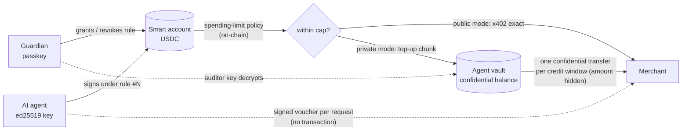

# ACAN: spending allowances for AI agents on Stellar

[](https://github.com/phoenix-2203/acan/actions/workflows/ci.yml)

ACAN lets a person give an AI agent a **capped, revocable spending key** for paid
APIs, and lets the agent pay **privately** without escaping that cap.

- The money sits in an **OpenZeppelin smart account** that the person (the
  *guardian*) controls with a passkey.
- The agent's key is honoured only under a **context rule** scoped to USDC and
  capped by an on-chain **spending-limit policy**. When the cap is reached, the
  smart account itself refuses to sign. No server has to be trusted to enforce it.
- The agent pays merchants over **x402**, the HTTP 402 payment protocol.
- In private mode the agent pays per request with signed **tab vouchers** and
  settles the whole tab in **one confidential transfer** whose amount is hidden
  on-chain. Only the merchant and the guardian (who holds the auditor key) can
  read it.
- The guardian can also make the allowance **expire**, restrict it to an
  **allowlist of merchants** (a Soroban policy contract in `contracts/`), and
  **approve one-off payments** above the limit with their passkey.
- The agent can be driven by a **language model** (Groq, Claude or a local
  model) that compares merchants' prices and stays within its budget.

Built for the *Find Your Way* hackathon (General Track). Everything runs on
Stellar **testnet**.

---

## Verified on testnet

**Public mode.** The agent bought from a standard x402 route until its 0.05 USDC/day
allowance ran out. Five payments of 0.01 USDC settled, for example
[`505d1ca2…`](https://stellar.expert/explorer/testnet/tx/505d1ca29d4c1427e20782a700dca548e4f0a6c90ce7312ba1269d92104378f4).
The sixth was refused by the smart account itself:

```
#6 BLOCKED by the smart account: SpendingLimitExceeded: the agent's allowance for this period is used up
```

**Private mode.** 7 paid requests, 0 per-request transactions, 3 confidential
settlements (allowance 0.20 USDC/day, credit limit 0.03 USDC):

| Step | Transaction | What the public sees |
|---|---|---|
| Top-up from the smart account (policy-checked) | [`35448963…`](https://stellar.expert/explorer/testnet/tx/3544896310c5f3600ddc3b086e25b0c8d09e086242e1d5c44d560f2a7870dd4a) | 0.10 USDC, a fixed-size chunk |
| Deposit into the confidential balance | [`17229ad5…`](https://stellar.expert/explorer/testnet/tx/17229ad5e96a4015c7d5c6fa486e1999e6f06ff4115885ddccfdd935e7754193) | 0.10 USDC |
| Settlement after requests 1–3 | [`0f466ad2…`](https://stellar.expert/explorer/testnet/tx/0f466ad20ddbaca87ccb7c953f0d74648c4ea32525a151307a18af9d3a96c7ec) | vault → merchant, **amount hidden** |
| Settlement after requests 4–6 | [`57924ba1…`](https://stellar.expert/explorer/testnet/tx/57924ba11591129f8cb3389a6d5eb538d1fa1cdbecd8d7e85a516afb2415ba96) | vault → merchant, **amount hidden** |
| Tab closed after request 7 | [`70b5dec8…`](https://stellar.expert/explorer/testnet/tx/70b5dec854e3cf715041fa791fdcb2fae066ae7ea6a17ca9e1b7e8a1ad507014) | vault → merchant, **amount hidden** |

`npm run audit`, decrypting with the guardian's auditor key:

```
GUARDIAN VIEW (decrypted with the auditor key)
  5074244   transfer agent-vault → merchant  0.03 USDC    vault balance after: 0.07 USDC
  5074248   transfer agent-vault → merchant  0.03 USDC    vault balance after: 0.04 USDC
  5074251   transfer agent-vault → merchant  0.01 USDC    vault balance after: 0.03 USDC

Total settled to the merchant: 0.07 USDC in 3 confidential transfer(s).
Merchant's ledger: owed 0.07 USDC, settled 0.07 USDC (MATCHES the decrypted total).
```

**AI agent, public mode** (Groq `openai/gpt-oss-120b`, rule with a 0.20 USDC/day
limit, a 7-day expiry and the merchant allowlist). Asked for the latest ledger and an
account's USDC balance, the model read both catalogs, checked its budget, and bought
each item from the cheaper merchant:

| Purchase | Merchant | Price | Transaction |
|---|---|---|---|
| `/api/ledger` | Southgate Data | 0.005 USDC | [`4110196d…`](https://stellar.expert/explorer/testnet/tx/4110196d891558c3fd6f64fb17cc81598e14c2075b751f3ee8a8ce080fe253ce) |
| `/api/balance` | Northwind Data | 0.02 USDC | [`d3d376f7…`](https://stellar.expert/explorer/testnet/tx/d3d376f710a1a068d67693e1f74c795b797ea849937ebfd0c03ba4bbda7c8d62) |

Both payments passed the spending-limit policy and the allowlist policy on-chain.

**AI agent, private mode.** Same task with `--private`: both purchases were paid with
vouchers, then settled in confidential transfers whose amounts are hidden on-chain
([`05ffdfc9…`](https://stellar.expert/explorer/testnet/tx/05ffdfc9824827bc371ad4379bb71aa4ca9f1554c2a6c38b7407d8d1689b5b4e),
[`02e6c263…`](https://stellar.expert/explorer/testnet/tx/02e6c2634346ebea5d7655022234f0439bd8aa6dc3189488272f2e49894b654d),
[`178e5358…`](https://stellar.expert/explorer/testnet/tx/178e535825a1ab2c0f52ce3aa00c3e88b302c1c3cb4950114b782f7cf1761d7b)).
The vault was refilled through the capped rule
([top-up `d673caca…`](https://stellar.expert/explorer/testnet/tx/d673caca8ec13a1738e7faa48860b08104076572041bf4bc866033d33ceae916)).
The guardian's audit then matched each merchant's own ledger:

```
Settled to merchant A: 0.11 USDC in 5 confidential transfer(s); merchant's ledger: owed 0.11 USDC, settled 0.11 USDC (MATCHES the decrypted total).
Settled to merchant B: 0.01 USDC in 1 confidential transfer(s); merchant's ledger: owed 0.01 USDC, settled 0.01 USDC (MATCHES the decrypted total).
```

---

## How it works



### 1. The allowance (OpenZeppelin smart account)

The guardian creates a smart account with a passkey in the dashboard
(`apps/web`, using `smart-account-kit`). Granting an agent adds a **context rule**:

- scope: calls to the USDC contract only (`CallContract(USDC)`);
- signer: `External(ed25519_verifier, agent_public_key)`;
- policy: OpenZeppelin `spending_limit` (e.g. 0.20 USDC per 17,280 ledgers ≈ 1 day,
  rolling).

The agent never holds funds. It signs the smart account's Soroban auth entry
with an OZ `AuthPayload` (`packages/core/src/agent-signer.ts`). The account's
`__check_auth` runs the policy, so an over-limit transfer fails at simulation and
again on-chain. Revoking the rule kills the key instantly.

### 2. Public mode: standard x402

`SmartAccountExactStellarScheme` is a drop-in x402 client for the `exact` Stellar
scheme. It produces the same payload as the official `@x402/stellar` client,
except that the payer's auth entry is signed for a C-address. Merchants use the
stock `@x402/express` middleware.

Two limits of the public facilitator block smart-account payers today:
its 50,000-stroop fee ceiling (a policy-checked payment simulates at roughly
2.3M stroops) and its rule that a payment may emit only `transfer` events (the
policy contract emits its own). So the demo merchant runs the same facilitator
code in-process (`FACILITATOR=local`) through `SmartAccountAwareFacilitator`.
That facilitator ignores events emitted by the payer and the known OZ
verifier/policy contracts, but still requires exactly one correct `transfer`
from the asset.

### 3. Private mode: tabs settled confidentially

Paying on-chain per request leaks every purchase, and its amount, to anyone. In
private mode the merchant offers a second x402 scheme, **`acan-tab`**:

1. **Per request: a voucher, not a transaction.** The agent signs
   `{payer, payee, token, nonce, amount, cumulative, resource, issuedAt}` with its
   vault key (domain-separated SHA-256, Ed25519). Vouchers are chained: nonce
   n+1 must follow n, and `cumulative` must equal the previous total plus
   `amount`. Replays and reordering are rejected. The merchant always holds one
   signed statement of the full debt.
2. **Credit limit.** The merchant extends at most `creditLimit` (0.03 USDC) of
   unsettled debt. When the next voucher would exceed it, the agent first pays
   everything owed in **one confidential transfer** and attaches its hash.
3. **Merchant verification.** The merchant finds the transfer event in that
   transaction, checks it goes *payer vault → merchant*, decrypts the amount
   with its viewing key, credits it once, then accepts the voucher.
4. **Closing the tab.** At the end the agent settles the remainder and reports
   it at `POST /tab/settle`.

The confidential balance can only be filled from the smart account **through the
agent's capped rule**: `smartAccountTransfer` moves USDC from the smart account
to the vault, then `deposit` and `merge` move it into the confidential balance.
Privacy does not loosen the guardian's cap. Top-ups use a fixed chunk (0.10 USDC)
so the public top-ups do not reveal individual settlement amounts.

The confidential token wraps testnet USDC. Balances are Pedersen commitments, and
`register`, `confidential_transfer` and `withdraw` each carry an UltraHonk
zero-knowledge proof that is **verified on-chain**. Every transfer also carries
auditor ciphertexts. The guardian holds the auditor key for this deployment, so
`npm run audit` shows exactly what the agent spent, while the public sees only
"vault → merchant, amount hidden".

### 4. More guardian controls

All of these are enforced by the smart account on-chain, or checked in the
guardian's own browser before the passkey signs anything.

- **Expiring allowances.** The dashboard can set the rule's `valid_until`
  ledger (1 hour, 1 day or 7 days). After it, the smart account refuses the
  agent's key (`UnvalidatedContext`), with no further action.
- **Merchant allowlist** (`contracts/merchant-allowlist-policy`). A Soroban
  policy contract for OpenZeppelin smart accounts: the agent's rule may only
  `transfer` to recipients the guardian picked (the two merchants and the
  agent's own vault). It is installed next to the spending-limit policy in the
  same passkey approval, so both must pass for every payment. Any other
  recipient fails with `RecipientNotAllowed` (#3401).
- **One-off approvals.** When the allowance blocks a purchase, the agent can
  ask the guardian. The request appears in the dashboard (through the local
  guardian service, `npm run guardian`). The dashboard decodes the
  authorization entry itself and refuses to sign unless it is exactly the
  claimed USDC transfer: right token, recipient and amount, from this account,
  with no extra calls. The guardian then signs that single payment with their
  passkey under their own rule, so the agent's allowance is unchanged.
- **Private-spending panel.** The dashboard shows each confidential settlement
  twice: what the public sees ("hidden") and what the guardian's auditor key
  decrypts, locally on the guardian's machine.

### 5. The AI agent

`npm run agent:ai` hands a task to a language model with five tools:
`list_merchants`, `check_budget`, `buy`, `request_approval` and `finish`.
Two demo merchants sell the same real testnet data at different prices
(Northwind Data on port 4021, Southgate Data on port 4022), so the model has to
compare catalogs and buy each item from the cheaper one. Every payment still
goes through the smart account, so the on-chain limit binds the model whatever
it decides; the model only chooses *what* to buy. `--private` makes it pay with
tab vouchers and settle confidentially.

Providers (no SDKs, plain HTTPS): Groq (`GROQ_API_KEY`, default model
`openai/gpt-oss-120b`), Claude (`ANTHROPIC_API_KEY`) or a local Ollama model
(`OLLAMA_MODEL`).

---

## Run it yourself (testnet)

Requirements: Node 22+, npm, pnpm 10 (for the vendored confidential-token SDK),
and a browser with passkey support.

```bash
npm install
npm run ct:build        # builds the vendored confidential-token SDK (vendor/ctd-demo)
npm run setup           # creates + funds MERCHANT, FACILITATOR, TREASURY; writes .env
# get testnet USDC for TREASURY at https://faucet.circle.com (Stellar Testnet)
npm run web             # guardian dashboard: http://localhost:5173
#   1. create the smart account with a passkey
#   2. authorize the agent key printed by setup, e.g. 0.20 USDC per day
#   3. paste SMART_ACCOUNT and AGENT_RULE_ID into .env
npm run fund:usdc -- 1  # move 1 USDC from TREASURY into the smart account
npm run merchant        # x402 merchant on http://localhost:4021 (FACILITATOR=local)
npm run agent           # public mode: buys until the allowance blocks it
npm run status          # balances + allowance
```

Private mode:

```bash
npm run ct:setup        # agent vault, confidential keys; registers vault + both merchants (1 proof each)
npm run merchant        # restart: every paid route now also accepts acan-tab
npm run agent:private   # 7 requests, settles every 0.03 USDC confidentially, closes the tab
npm run audit           # public view vs guardian view
npm run merchant:cashout  # optional: merchant withdraws its confidential balance to public USDC
```

Guardian controls and the AI agent:

```bash
npm run allowlist:deploy  # build + deploy the merchant allowlist policy (Rust, stellar CLI); saves ALLOWLIST_POLICY
npm run guardian          # local service for approvals + the private-spending panel (port 4030)
npm run merchant:b        # second merchant, different prices (port 4022)
# in the dashboard: authorize the agent with an expiry and the allowlist ticked
# put ONE of GROQ_API_KEY / ANTHROPIC_API_KEY / OLLAMA_MODEL in .env
npm run agent:ai              # the model compares both merchants and buys within its allowance
npm run agent:ai -- --private # same, paying with vouchers and confidential settlements
```

The confidential-token addresses in `packages/confidential/src/deployment.ts`
point at ACAN's deployment, which wraps testnet USDC. To use your own,
deploy with the vendored scripts
(`cd vendor/ctd-demo && CTD_UNDERLYING=<USDC SAC> pnpm deploy:contracts`), then
update that file. The deploy writes the auditor key to
`vendor/ctd-demo/deployments/testnet.json` (git-ignored), and `ct:setup` copies
it into `.env`.

Tests (offline, also run by CI on every push):

- `npm test`: the agent's auth payload against `smart-account-kit`, the
  facilitator event filter, voucher signing, the tab ledger, a full x402 HTTP
  round-trip of `acan-tab` next to `exact`, decryption by both the merchant and
  the auditor, the model adapters' tool-call handling, and the dashboard's
  approval safety checks.
- `npm run test:contracts`: the allowlist policy, including an integration test
  that runs OpenZeppelin's real smart-account auth with the spending-limit
  policy and the allowlist on one rule.

---

## Repository layout

```
packages/core           smart-account agent signer, x402 client scheme, smart-account-aware
                        facilitator, smartAccountTransfer, acan-tab scheme (voucher, ledger,
                        client, server, facilitator)
packages/confidential   wrapper over the confidential-token SDK: ConfidentialAccount,
                        ConfidentialVault (policy-capped top-ups), MerchantInbox (decrypts settlements)
apps/web                guardian dashboard: passkey smart account, grant (limit, expiry, allowlist)
                        and revoke allowances, approval requests, private-spending panel
apps/merchant           demo x402 merchants A and B: catalog at /, paid data routes (exact + acan-tab)
apps/agent              agent.ts (public), agent-private.ts (private), agent-ai.ts (language model),
                        wallet.ts (shared payment logic), llm.ts (Groq / Claude / Ollama adapters)
contracts               merchant-allowlist-policy: Soroban policy contract for OZ smart accounts
scripts                 setup, fund, status, diagnose, ct-setup, audit, merchant-cashout,
                        guardian (local approvals + audit service), deploy-allowlist
vendor/ctd-demo         brozorec/stellar-confidential-token-demo @ 9500ed7 (MIT), one patch
```

## Security model and limitations

- **What the cap guarantees.** The agent can move at most the policy amount per
  period out of the smart account, whatever it does, because the check runs in
  the account's `__check_auth`. That covers x402 payments and vault top-ups alike.
- **What privacy hides.** Settlement amounts and the agent's confidential
  balance. It does **not** hide who pays whom (sender and recipient are public),
  or top-ups and withdrawals, whose amounts are public by design.
- **Revocation and the vault.** Revoking the rule stops new top-ups at once, but
  USDC already moved into the agent's vault stays under the agent's control. Top-ups
  are only as large as needed, rounded up to one chunk, so this leftover is at most
  one chunk (0.10 USDC here) and always within the cap. A production version
  would let the guardian claw back or freeze the vault.
- **What the allowlist covers.** It restricts payments out of the smart
  account (x402 payments and vault top-ups). Settlements out of the agent's
  confidential vault are confidential transfers and are not checked by it; the
  vault only ever holds what the capped rule let in.
- **Approvals.** The guardian service only relays requests; it never signs.
  The passkey signature is made in the guardian's browser after the dashboard
  checks the request against the transaction it would authorize.
- **The model is not trusted.** The language model chooses what to buy, but
  cannot change the rule, the limit, the expiry or the allowlist: those need the
  guardian's passkey.
- **Merchant credit risk.** A merchant serving on credit risks at most
  `creditLimit` per payer. The signed voucher chain is its evidence of the debt.
- **Event retention.** Confidential balances are rebuilt from contract events.
  Public RPC keeps about 7 days of events, so the agent and merchant persist state
  locally (`.acan/`) and must sync within that window.
- **Preview technology.** The confidential token is built on an OpenZeppelin
  `stellar-contracts` feature branch, and its verifier and circuits are
  **unaudited**. Testnet only; do not use with real value.
- **Facilitator.** Smart-account payers currently need a facilitator with a
  higher fee ceiling and smart-account-aware event checks (provided here).

## Credits

- [OpenZeppelin stellar-contracts](https://github.com/OpenZeppelin/stellar-contracts):
  smart accounts, policies, verifiers, confidential token module.
- [stellar/smart-account-kit](https://github.com/stellar/smart-account-kit): passkey
  smart-account client and the SDF relayer proxy.
- [x402](https://github.com/coinbase/x402): `@x402/*` 2.28.0.
- [brozorec/stellar-confidential-token-demo](https://github.com/brozorec/stellar-confidential-token-demo)
  (MIT), vendored in `vendor/ctd-demo`. ACAN patched only `scripts/deploy.ts`, so the
  confidential token can wrap any SEP-41 token (`CTD_UNDERLYING`).

## License

MIT
